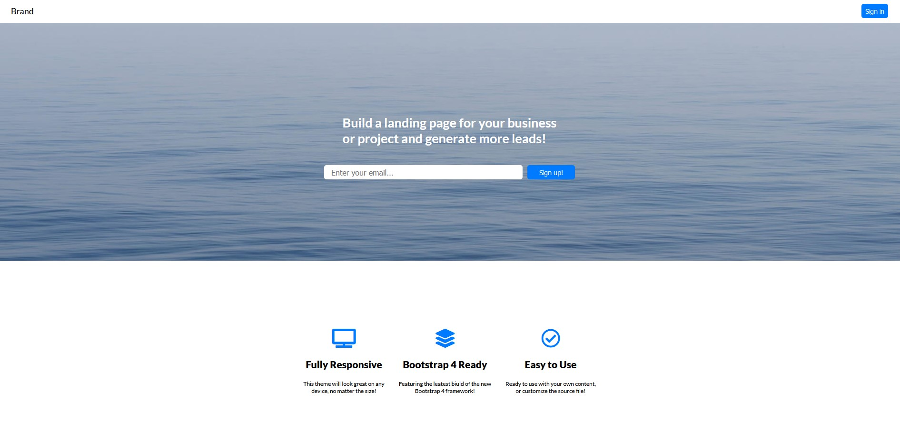

## Example Landing Page

### Functionality

This basic landing page can be used as a template for different types of internet pages such as eCommerce, Informative, News/Entertainment, Forum/Blogs.

### Acknowledgments

- I use [React.js](https://reactjs.org/) for the templating, DOM manipulation.
- [Create react app](https://create-react-app.dev/) for the scaffolding and building.
- [Font Awesome](https://fontawesome.com/) for the icons.
- [CSS Variables](https://developer.mozilla.org/en-US/docs/Web/CSS/Using_CSS_custom_properties) to apply custom properties.
- [HTML5](https://developer.mozilla.org/en-US/docs/Glossary/HTML5) for a more versatile standard, improving the user experience and facilitating the debugging of the web code.
- [Netlify](https://www.netlify.com) for the production deployment.
